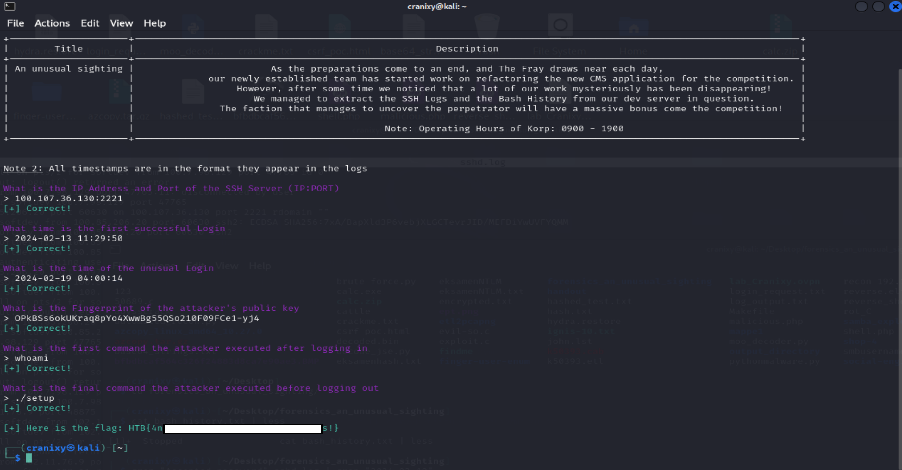

# An Unusual Sighting (Forensics Challenge)

**Points:** 900  
**Difficulty:** Very Easy  
**Category:** Forensics Challenges

---

## Challenge description

As the preparations come to an end, and *The Fray* draws near each day, our newly established team has started work on refactoring the new CMS application for the competition. However, after some time we noticed that a lot of our work mysteriously has been disappearing!

We managed to extract the SSH Logs and the Bash History from our dev server in question. The faction that manages to uncover the perpetrator will have a massive bonus come competition!

Files provided:
- `sshd.log`
- `bash_history.txt`

---

## Steps I took

1. Connected to the challenge via `nc 94.237.61.242 48101`, where we were greeted with the mission description and log-based questions.  
2. Opened `sshd.log` and searched for IP addresses and ports used in connections.  
   Found the correct entry: `100.107.36.130:2221`  
3. Looked for the **first successful login** by finding the earliest `Accepted password` entry:  
   `2024-02-13 11:29:50`  
4. Searched for a login that occurred **outside the allowed time (09:00–19:00)**.  
   Found a successful login at `2024-02-19 04:00:14` — clearly suspicious.  
5. Checked the SSH log entries around that timestamp to get the **attacker’s public key fingerprint**:  
   `OPkBSs6okUKraq8pYo4XwwBg55QSo210F09FCe1-yj4`  
6. Opened `bash_history.txt` to trace actions executed after login.  
7. Verified the **first command run** by the attacker was:  
   `whoami`  
8. Scrolled to the bottom of the file to find the **final command** executed before logout:  
   `./setup`  
9. Submitted the answers in the order the system requested — and received the flag.

---

## Screenshot

---

## Flag
HTB{4n_unusual_s1ght1ng_1n_SSH_l0gs!}

---

[← Back to home](../../README.md)
