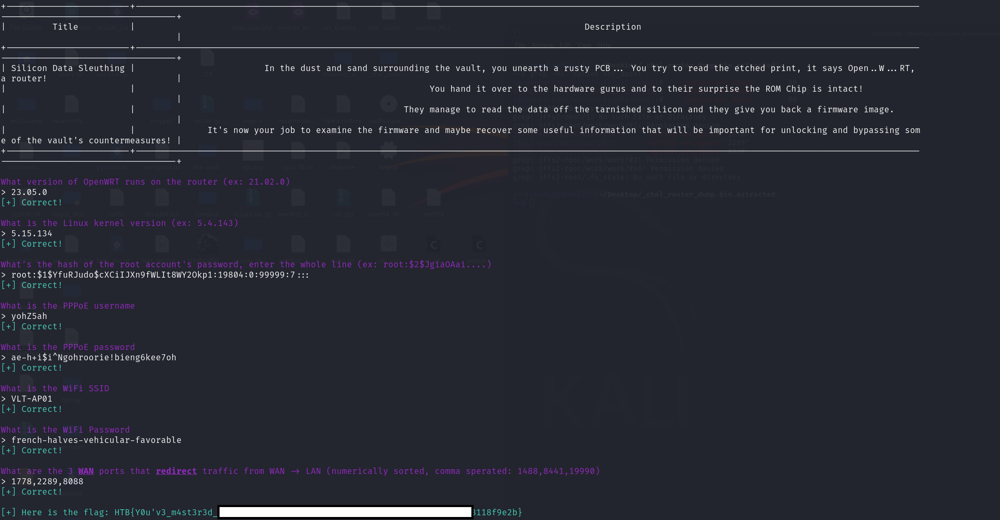

# Silicon-Data-Sleuthing (Forensics Challenge)

**Points:** 975  
**Difficulty:** Easy  
**Category:** Forensics Challenges

---

## Challenge description

In the dust and sand surrounding the vault, you unearth a rusty PCB... You try to read the etched print, it says Open..W...RT, a router! 

You hand it over to the hardware gurus and to their surprise the ROM Chip is intact! 
They manage to read the data off the tarnished silicon and they give you back a firmware image. 

It's now your job to examine the firmware and maybe recover some useful information that will be important for unlocking and bypassing some of the vault's countermeasures!

Files used:
- `chal_router_dump.bin`

---

## Steps I took

1. Question: What version of OpenWRT runs on the router?
   To begin, I extracted the contents of the `.bin` dump using `binwalk`: `binwalk -e chal_router_dump.bin`. After running it, a folder is created.
   I then moved into the extracted directory to explore the contents: `cd _chal_router_dump.bin.extracted`. This is where all the juicy stuff from the router is dumped.
   Then `grep -r "OpenWrt"`. Answer: OpenWrt 23.05.0.
2. Question: What is the Linux kernel version?
   `cd .. && strings chal_router_dump.bin | grep -i "OpenWrt"`. Answer: Linux-5.15.134.
3. Question: What's the hash of the root account's password, enter the whole line?
   `grep -R --no-filename '^root:' _chal_router_dump.bin.extracted/`. Answer: root:$1$YfuRJudo$cXCiIJXn9fWLIt8WY2Okp1:19804:0:99999:7:::.
4. Question: What is the PPPoE username?
   `cd _chal_router_dump.bin.extracted && grep -Ri "username" jffs2-root`. Answer: yohZ5ah.
5. Question: What is the PPPoE password?
   `grep -Ri "password" jffs2-root`. Answer: ae-h+i$i^Ngohroorie!bieng6kee7oh.
6. Question: What is the WiFi SSID?
   `grep -Ri "ssid"`. Answer: VLT-AP01.
6. Question: What is the WiFi Password?
   `grep -Ri "key"`. Answer: french-halves-vehicular-favorable.
7. Question: What are the 3 WAN ports that redirect traffic from WAN -> LAN?
   I started by searching for `redirect`. `grep -Ri "redirect"`.
   Then `grep -Ri "option src_dport"`. Answer: 1778,2289,8088.
8. Submitted the answers in the order the system requested - and received the flag.

---

## Screenshot

---

## Flag
HTB{Y0u'v3_m4st3r3d_0p3nWRT_d4t4_3xtr4ct10n!!_4a5be874e42ea0c398f4eca8118f9e2b}

---

[← Back to home](../../README.md)
